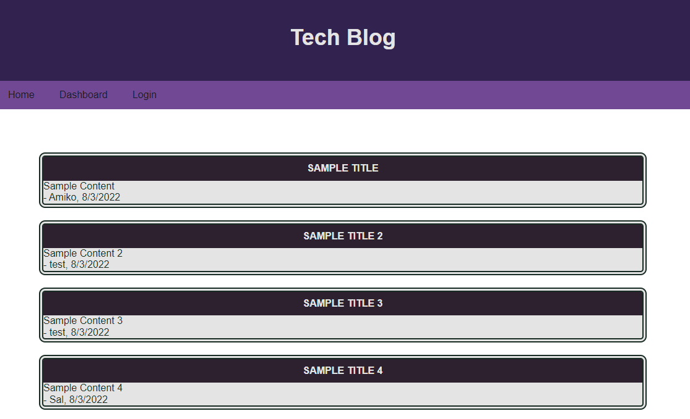
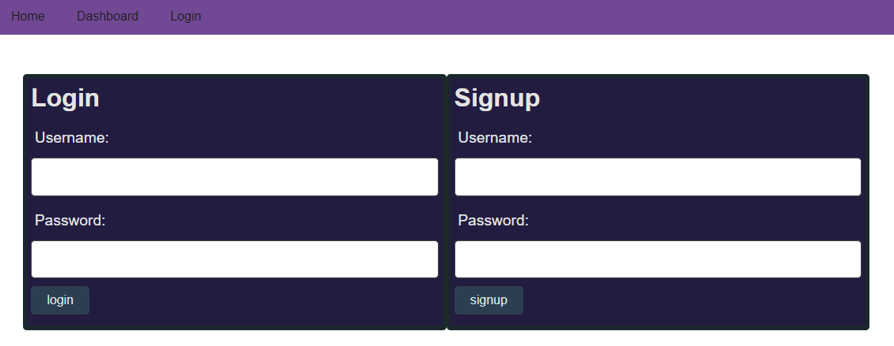
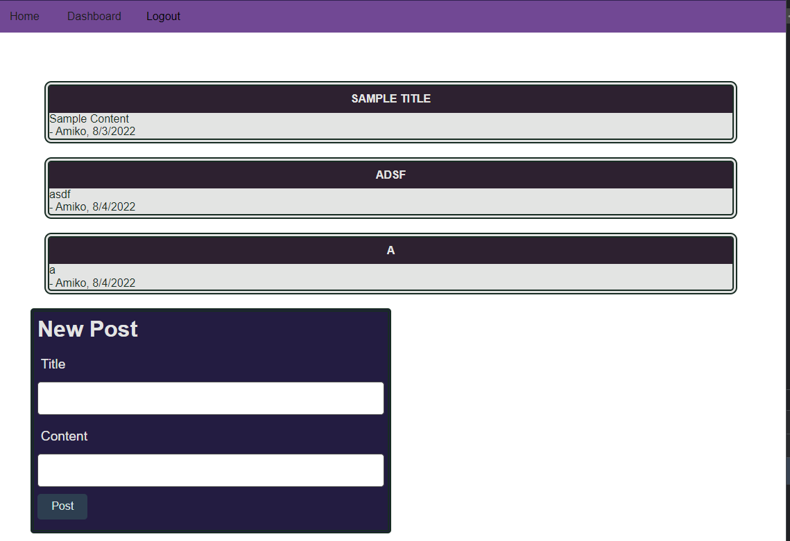
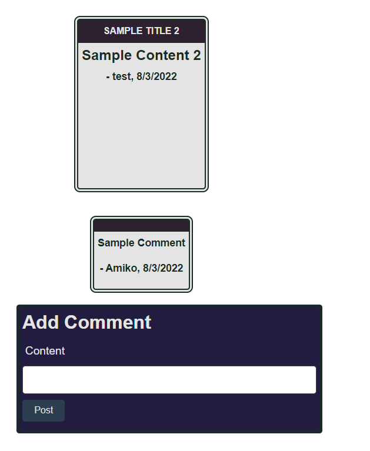

# tech-blog

## Description 

This is a full stack application of a blog style webpage deployed to heroku. It features the usage of cookies to retain login status, handlebars to dynamically create the webpage, and sequelize and mysql2 to manage the database models.

### [Deployed Site](https://secure-citadel-56844.herokuapp.com/)

## Table of Contents

* [Installation](#installation)
* [Usage](#usage)
* [Credits](#credits)
* [License](#license)


## Installation

Use the deployed site link above or clone repository and run on local machine. To install necessary dependencies, run the following command:
```npm i```

Run the ```schema.sql``` file in your mysql terminal.  
Create a .env file to authorize mysql.
Within your terminal, run the command ```npm run seed``` or ```node seeds/index.js```

## Usage 

If there is already existing data, the homepage of the site looks like this:


Before users can explore the site, users will first need to signup/login through the login page:


Upon completion, users will then be brough to their dashboard, where they will see their own posts, or add posts


Adding a new post will automatically update the page to show the new information.

Users will also be able to click on the titles the blog posts, to see comments or add their own.



## Credits

[Nodejs](https://nodejs.org/dist/latest-v16.x/docs/api/)

[bcrypt](https://www.npmjs.com/package/bcrypt)

[mysql2](https://www.npmjs.com/package/mysql2)

[dotenv](https://www.npmjs.com/package/dotenv)

[Connect Session Sequelize](https://www.npmjs.com/package/connect-session-sequelize)

[Express](https://www.npmjs.com/package/express)

[Express Sessions](https://www.npmjs.com/package/express-session)

[Express Handlebars](https://www.npmjs.com/package/express-handlebars)

[Sequelize](https://www.npmjs.com/package/sequelize)

## License

 This project is licensed under the MIT license.

[](https://opensource.org/licenses/MIT)